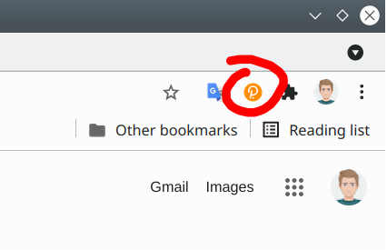
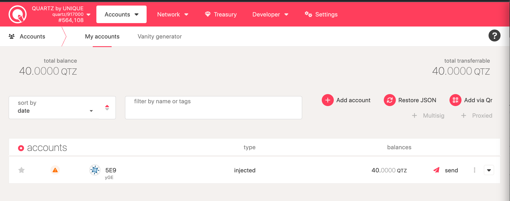
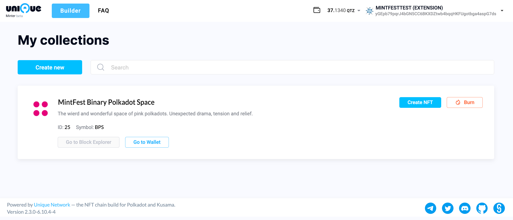
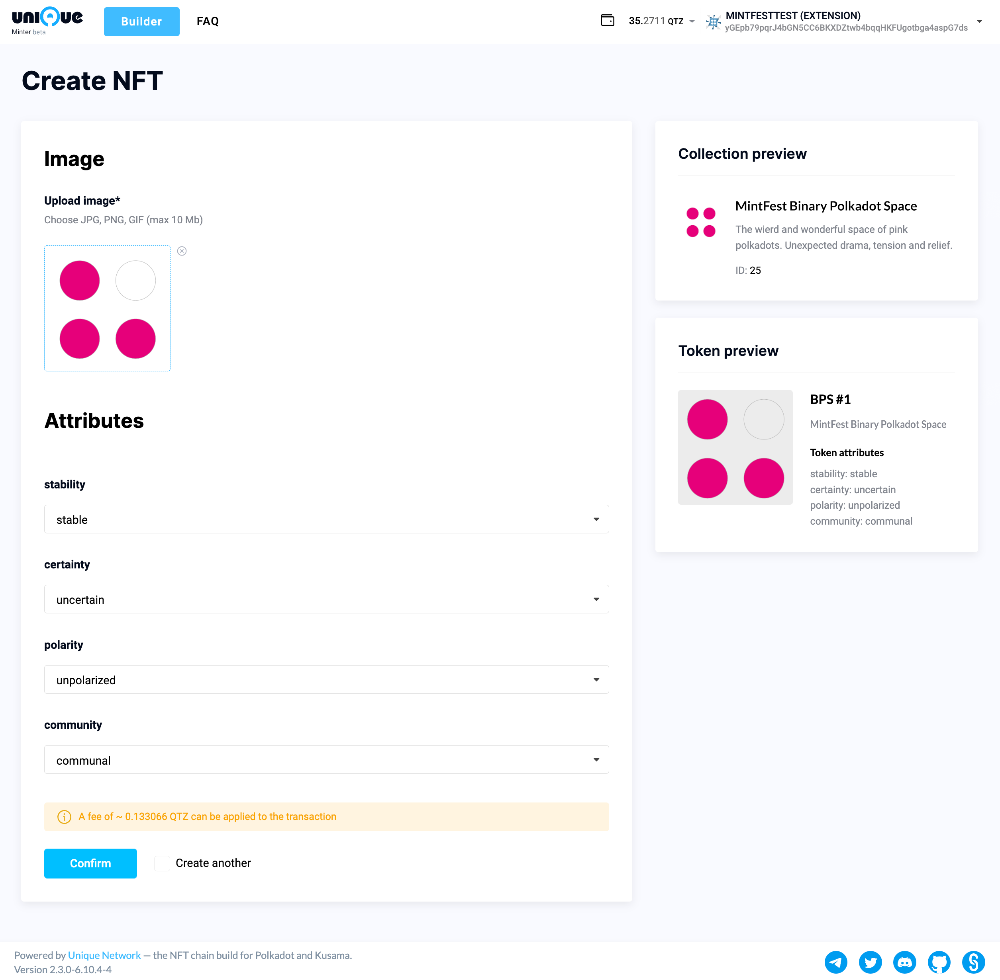

# Step 1 - Polkdot{.js} Extension Install
If you haven't done so already, set up the Polakdot{.js} wallet extension. This is the recommended way to manage and access your on-line wallet. Visit https://polkadot.js.org/extension/ and click on the “Download for Chrome” button. Chrome browser will guide you through the rest of the process.

Upon successful installation you should be able to access it by clicking on the extension icon in the browser toolbar. If the icon is not displayed, check the extension list menu that opens when you click the extensions icon (puzzle icon in the image below). If the extension was successfully installed, it will be listed in the menu. Click on the pin icon in the extension menu item to have the wallet extension always visible on the toolbar.

# Step 2 - Create An Admin Address

Click on the Polkadot{.js} extension icon and select “create new account” in the menu. Follow the instructions to set up an account.

For maximum security it is good practice to avoid using copy and paste to store the 12 word mnemonic seed digitally. Write down the 12 word mnemonic on a piece of paper and store the paper in a safe place. Anyone who obtains access to this 12 word mnemonic can also access your funds and NFT collections stored in this account so keep it safe and inaccessible.

Follow through with the instructions to complete the account setup.

# Step 3 - Obtain Quartz Tokens

In order to mint a collection you will need to have more than 5 QTZ at your disposal for minting fees. Quartz tokens can be obtained on digital asset exchanges like [MEXC](https://www.mexc.com/). To purchase on an exchange you will need to sign up. Once signed up, you can use the exchange's on-ramp options to purchase QTZ with fiat or with digital assets transferred to the exchange from your other account. After purchase, transfer the QTZ to your newly created Polkadot{.js} address. Take note, some exchanges will not allow you to withdraw your digital assets immediately after creating an account but only after a 12-24 hour period. Once that period expires withdrawal becomes available. If you already have an account, this does not affect you.

You will need to copy the destination address for your Quartz tokens and paste it into the destination field in the withdrawal section on the exchange, but before you do check if the address format is set to 'Allow use on any chain'.

Copy the address by either clicking on the colorful icon image or the copy icon.

Transfer your QTZ from the exchange to your Polakdot{.js} wallet providing the copied address as the recipient of withdrawal.

Check your transaction status:

And verify your Polakdot{.js} wallet for QTZ received:

# Step 4 - Prepare Your NFT images

Create a set of images that will comprise your NFT collection and place them in a folder. Optionally create a cover image (can be same size as the NFT image). If not, you can use any of the NFT images for a banner. Make a note on the traits you wish to assign to each NFT and make a note of which traits are assigned to which NFTs.

Traits are defined by the trait name and it's characteristics. For example, a face might have a trait that is named 'Expression' and it can have the following characteristics: 'happy', 'amused', 'angry', 'sad', 'content'... etc.

# Step 5 - Invoke The Collection Minter

Go over to the [Quartz Minter](https://minter-quartz.unique.network/) page.
Check that you are connected to the wallet that you transferred your Quartz to (in the upper right corner) and proceed by clicking on the "Create new" button.

This will open a page where you can set the name, description and the symbol that uniquely identifies your collection. All those who wish to participate in the Quartz MintFest should name their collection starting with 'MintFest'. So for the example given below a proper name would be 'MintFest Binary Polkadot Space'

You will need to authorize this transaction with your wallet. The price for collection creation was 100 QTZ during the test phase of the network but shuold be around 2 QTZ when it enters the public phase.

You will be informed of a transaction being processed and this might take a moment. Upon completion, you should see a notification in the top right corner of the page informing you of the transaction status.

Next, you will be presented with a page where you can set the cover image for the collection. Click on the file upload icon in the circle and provide a cover image. This step is optional, but you will be asked to confirm that you do not wish to create one.

Upon confirming you will again be asked to authorize and sign the transaction. On the page that follows you can set the collection attributes (traits). You add the trait by clicking on 'Add Field' and declaring the trait characteristics.

You will once more be asked to authorize the transaction and, after a confirmation message, be presented with "My collections" mangement page.

At this point you can start adding the NFTs to the collection. Click on the "Create NFT" button to begin. In the image below an example page is given for setting up the traits and the image for an NFT belonging to a collection we previously defined. All the traits that define the collection are listed on this page and can be set according to the characteristics for the current item. Remember to select the "Create another" checkbox if you wish to return to this page and continue adding NFTs. If you forget to set it, you will be returned to the "My collection" page. To add a new NFT just select "Create NFT" again. 

For each member you create, a fee of 0.1 QTZ is incurred. Each confirmation must be signed and authorized via the wallet.

Once you complete the inclusion of all the NFTs in the collection, you will be taken back to the "My collections" page. To view your collection click on "Go to Wallet". You will be presented with a page listing all your tokens.

Clicking on any of the tokens will open the corresponding token page

You have thus successfully created a new NFT collection in the Quartz parachain.